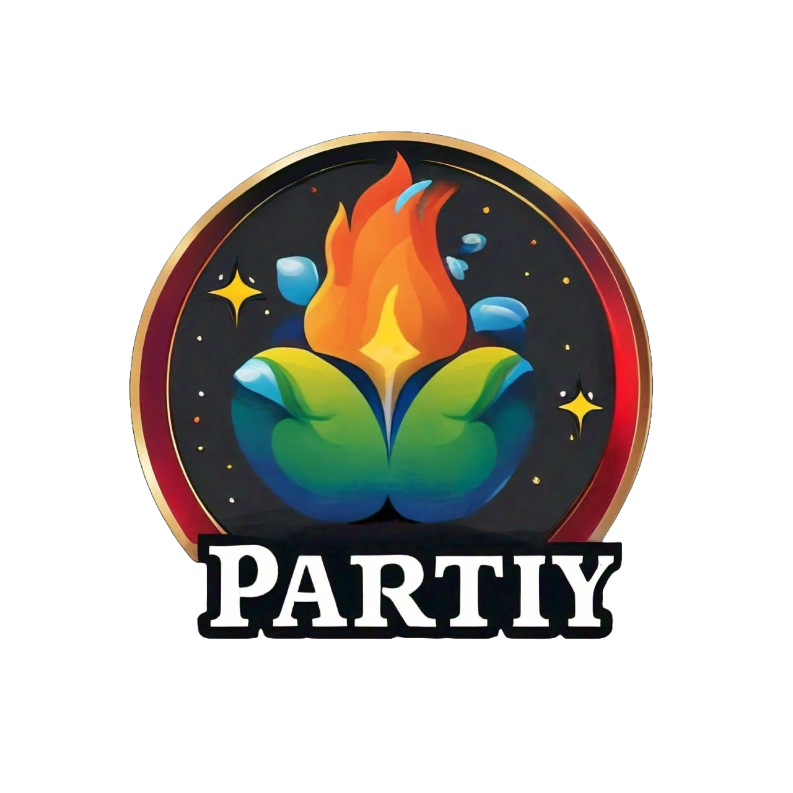
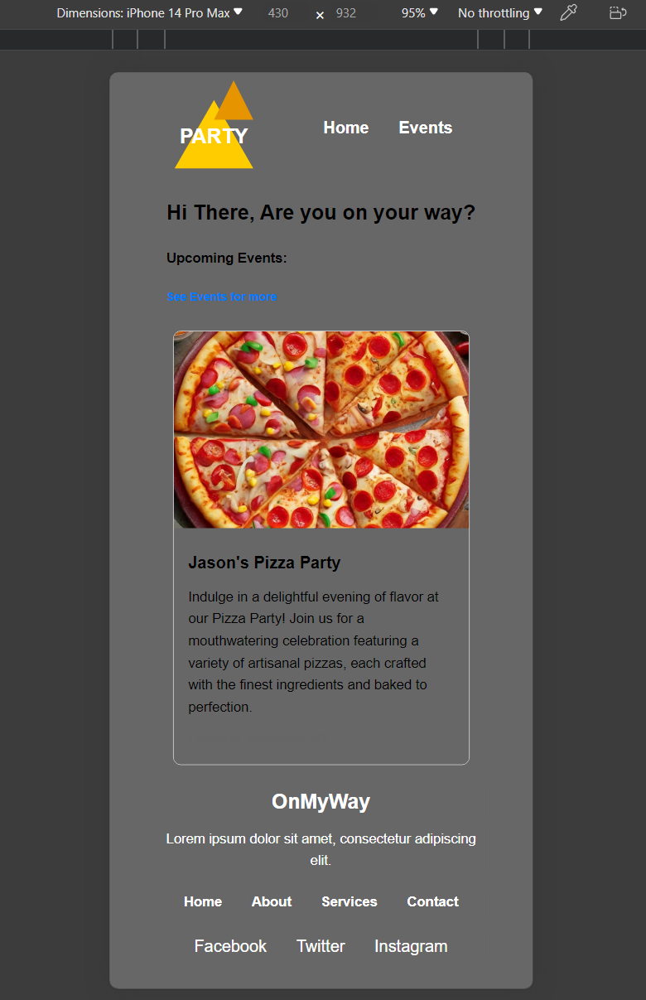
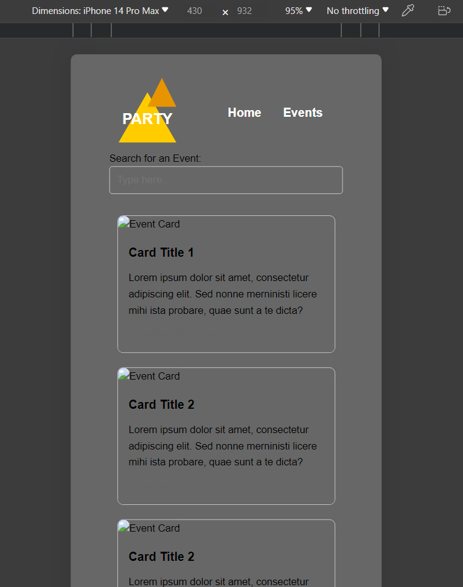
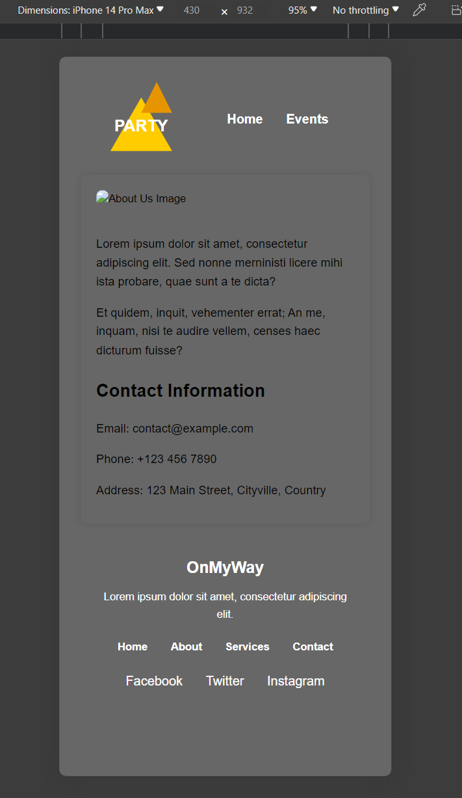

# PartyApp
RSVP Party app.

 

    
  

<!-- TABLE OF CONTENTS -->

  
Table of Contents

  <ol>
    <li>
      <a href="#about-the-project">About The Project</a>
      <ul>
        <li><a href="#built-with">Built With</a></li>
      </ul>
    </li>
    <li>
      <a href="#getting-started">Getting Started</a>
      <ul>
        <li><a href="#prerequisites">Prerequisites</a></li>
        <li><a href="#installation">Installation</a></li>
      </ul>
    </li>
    <li><a href="#usage">Usage</a></li>
    <li><a href="#contact">Contact</a></li>
    <li><a href="#acknowledgments">Acknowledgments</a></li>
  </ol>

### About The Project:

### Built With:

Party App is powered by: 

* JavaScript
* CSS
* HTML
* React
* Ruby
* Rails on Ruby
* PostgreSQL

<!-- USAGE EXAMPLES -->
## Usage

 

    
  

 

    
  

 

    
  

<!-- CONTACT -->
## Developed by:

Alan 
* https://courageous-alpaca-aca2e9.netlify.app/ - Portfolio
* https://www.linkedin.com/in/alantmatos/ -  Linkedin
* https://github.com/alantmatos - GitHub

Logan
* https://www.linkedin.com/in/loganguillory0127/ - Linkedin
* https://github.com/loganguillory - GitHub
* @logancodez - Twitter

<!-- ACKNOWLEDGMENTS -->
## Acknowledgments

Bugs and fixes:

